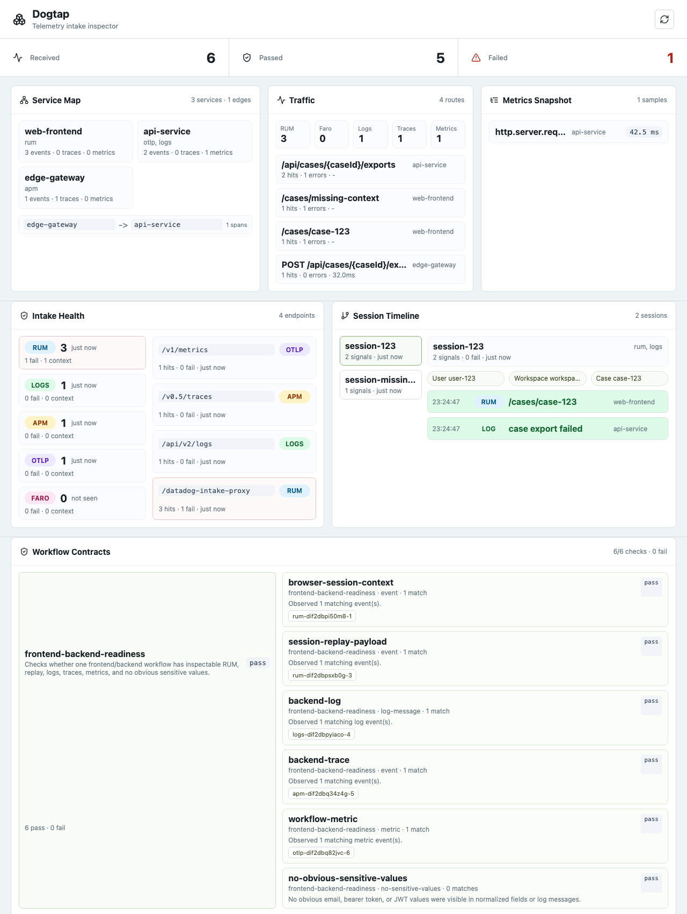
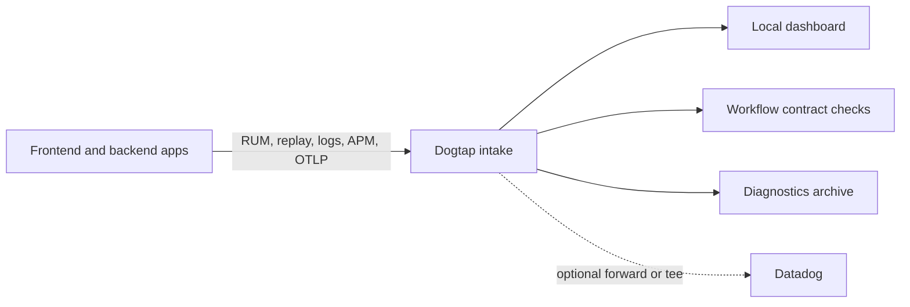

# Dogtap


Datadog-compatible telemetry intake inspector for local development, CI
validation, and production-safe forwarding experiments.

Dogtap answers a practical question: before telemetry disappears into Datadog,
did this app emit enough context to debug the workflow?



_Seeded demo dashboard with Browser RUM, Session Replay, backend logs, APM
spans, OTLP metrics, service map, workflow contracts, validation failures, and
Datadog search hints._

`dogtap` is designed for the fast path in local development and routine CI:

- use `dogtap` as the local intake target for RUM, logs, traces, and OTLP
- assert workflow telemetry contracts such as login, checkout, or case open
- keep Datadog and OpenTelemetry Collector as the high-fidelity production path

It makes telemetry payloads visible before they reach Datadog. It is not a
Datadog clone, monitor engine, query engine, or long-term observability store.

## What You See

| Surface | What Dogtap helps verify |
| --- | --- |
| Service map and traffic | Which frontend/backend services, routes, and edges actually emitted telemetry |
| Browser sessions | RUM session IDs, user/workspace/case context, and Session Replay payloads |
| Logs and traces | Backend log messages, trace/span trees, and cross-source trace correlation |
| Metrics | OTLP metric names, services, routes, units, sample values, and retained charts |
| Workflow contracts | Whether real paths such as login or checkout produced enough observable evidence |
| Diagnostics bundle | Machine-readable assertions, likely root causes, artifacts, and next checks for agents or CI |



## Why This Project Exists

Datadog instrumentation often fails semantically before it fails syntactically:

- frontend errors arrive without user, route, workspace, or trace context
- backend logs have `service` and `env` but no stable route or correlation ID
- traces and logs cannot be joined by trace/span IDs
- session replay, logs, traces, and metrics are emitted but hard to inspect
- query strings, emails, bearer tokens, or unstable high-cardinality fields leak
  into telemetry
- local and CI environments disable telemetry because Datadog is noisy,
  expensive, or unavailable

`dogtap` provides a local and CI-friendly intake target so teams can see exactly
what their apps emit and turn that shape into a testable telemetry contract.

## Recommended Adoption Model

Use two lanes instead of forcing one telemetry path to satisfy every workflow:

- default local/CI lane: `dogtap` for fast payload inspection, validation, and
  regression checks
- production fidelity lane: Datadog agent, Datadog intake, or OpenTelemetry
  Collector for deployment behavior and vendor-specific compatibility

This keeps the common feedback loop fast without pretending that a local
inspector is a complete Datadog replacement.

For apps that already use Datadog, prefer external injection: add Dogtap as a
sidecar or service and override standard Datadog/OTLP endpoints from environment
or runtime config. The app should keep its existing Datadog Browser RUM SDK,
Datadog tracer, log framework, and OpenTelemetry SDK where possible.

## Value For Frontend And Backend Teams

Dogtap is most useful when you want to verify:

- Browser RUM context, including user/session/route/workflow fields
- RUM Session Replay payload arrival and decoded replay metadata
- structured logs, including trace IDs and redacted unsafe fields
- Datadog APM trace/span payloads from existing tracers
- OTLP traces, logs, and metrics from OpenTelemetry SDKs or collectors
- service map, route traffic, metric charts, and cross-source correlation
- workflow contract results that summarize whether a real user path is
  observable enough to debug
- failed contract drilldowns with evaluated selector criteria and closest
  retained telemetry alternatives
- diagnostics root-cause hints for missing browser, log, trace, metric,
  endpoint, context, and Dogtap API evidence
- copyable Datadog search hints for the payloads Dogtap received
- Datadog API-compatible logs, RUM, spans, and metric query responses for
  local retained telemetry

## Dogtap vs Datadog / OTel Collector

| Topic | `dogtap` | Datadog / OTel Collector |
| --- | --- | --- |
| Primary fit | Local inspection and CI contract validation | Production telemetry routing and observability |
| Startup shape | Single local process/container | Agent, collector, or hosted intake |
| Dashboard | Payload/debug oriented | Full observability UI or routing pipeline |
| Storage | Bounded local memory/file/SQLite retention | Production retention and query systems |
| Safety model | Redaction, sampling, bounded queue, no raw prod by default | Depends on deployment and vendor config |
| Best use | Prove that instrumentation is useful and safe before release | Operate production systems |

Recommended strategy:

- use `dogtap` for day-to-day instrumentation feedback
- keep direct Datadog/OTel paths for release and production verification

## Why This Can Work As A Default Lane

`dogtap` is optimized around adoption ergonomics, not full vendor emulation:

- standard Datadog Browser RUM proxy configuration
- standard Datadog tracer environment variables
- standard OTLP HTTP and gRPC exporters
- read-only Datadog API-compatible search/query paths for retained local
  telemetry, including structured log aliases and metric route/method/status
  scope tags for agent debugging
- optional SQLite persistence for restart-safe local, CI, and dev-cluster
  inspection without running a database service
- copyable Docker Compose and environment snippets
- deterministic fixture replay and JSON/Markdown reports
- explicit compatibility and production-safety boundaries

Applications should not need a Dogtap-specific SDK. Removing Dogtap should be a
configuration-only change that restores the original Datadog or OTLP endpoints.

## When To Use / Not Use

| Decision | Use when... |
| --- | --- |
| Use | You need to inspect telemetry payloads locally without Datadog credentials |
| Use | You want CI to fail on missing context or unsafe telemetry fields |
| Use | You need a compact debug bundle that explains what to search in Datadog |
| Use | You want to test Datadog/OTLP configuration changes before rollout |
| Do not use | You need a full Datadog dashboard, monitor, notebook, or query engine |
| Do not use | You need long-term production telemetry storage |
| Do not use | You require full private Datadog endpoint compatibility |
| Do not use | You want Dogtap to be a critical production dependency without a fail-open plan |

## Quick Start

### 1. Start Dogtap

```bash
docker compose up --build
```

Open:

```text
http://localhost:8080
```

Source mode:

```bash
go run ./cmd/dogtap serve -config configs/generic-local.yaml
```

The default Compose and generic local profiles use bounded SQLite storage at
`/data/dogtap.db` or `.dogtap/generic-local.db`, so recent telemetry survives
restarts without becoming long-term retention.

### 2. Point Browser RUM At Dogtap

Preferred: expose the RUM proxy through runtime config and inject it from the
outside:

```bash
DATADOG_RUM_PROXY_URL=http://localhost:8080/datadog-intake-proxy
```

Then pass that value to the existing Datadog RUM init object:

```ts
datadogRum.init({
  applicationId: "local",
  clientToken: "local",
  site: "datadoghq.com",
  service: "your-frontend",
  env: "local",
  version: "local",
  ...(runtimeRumProxy ? { proxy: runtimeRumProxy } : {}),
});
```

If the app hardcodes Datadog RUM setup, make the proxy value
runtime-configurable once. Future Dogtap enable/disable operations should then
be configuration-only.

Before canarying RUM or Session Replay proxying outside local-only debugging,
use [docs/runbooks/RUM_PROXY_CANARY.md](docs/runbooks/RUM_PROXY_CANARY.md).

### 3. Point Backend Telemetry At Dogtap

OTLP HTTP, host process:

```bash
export OTEL_SERVICE_NAME=your-backend
export OTEL_RESOURCE_ATTRIBUTES=deployment.environment=local,service.version=local
export OTEL_EXPORTER_OTLP_ENDPOINT=http://localhost:4318
export OTEL_EXPORTER_OTLP_PROTOCOL=http/protobuf
export OTEL_TRACES_EXPORTER=otlp
export OTEL_LOGS_EXPORTER=otlp
export OTEL_METRICS_EXPORTER=otlp
```

Existing Datadog tracer, host process:

```bash
export DD_TRACE_AGENT_URL=http://localhost:8126
export DD_AGENT_HOST=localhost
export DD_TRACE_AGENT_PORT=8126
export DD_ENV=local
export DD_SERVICE=your-backend
export DD_VERSION=local
export DD_TRACE_SAMPLE_RATE=1
export DD_LOGS_INJECTION=true
```

For Docker Compose services in the same network, use `dogtap` instead of
`localhost`.

### 4. Send A Logs Smoke Payload

```bash
curl -sS -X POST http://localhost:8080/api/v2/logs \
  -H 'Content-Type: application/json' \
  -d '{"service":"your-backend","env":"local","version":"local","status":"info","message":"dogtap log smoke"}'
```

### 5. Verify The Generic Path

```bash
make smoke-adoption
```

Expected evidence:

- RUM payloads appear under `source=rum`
- logs appear under `source=logs`
- Datadog tracer payloads appear under `source=apm`
- OTLP traces/logs/metrics appear under `source=otlp`
- dashboard panels show service map, traffic, replay payloads, logs, trace
  spans, metrics, validation results, and search hints

### 6. Capture Live Diagnostics

For Docker Compose or another externally managed Dogtap container, use the HTTP
API:

```bash
curl -sS -X POST http://localhost:8080/api/diagnostics \
  -H 'Content-Type: application/json' \
  -d '{"expect":{"nonEmpty":true,"sources":["rum","logs","apm","otlp"]}}'
```

Add workflow contracts when you want to assert that a specific user path is
observable, not just that generic telemetry arrived:

```bash
go run ./cmd/dogtap diagnose \
  -workflow-contract configs/contracts/login.yaml \
  -fail-on-workflow-contract
```

Starter contracts are available for `login`, `case-open`, `checkout`,
`report-export`, and generic frontend/backend readiness. A reusable GitHub
Actions template lives under `examples/github-actions/`.

The diagnostics API accepts the same idea inline:

```bash
curl -sS -X POST http://localhost:8080/api/diagnostics \
  -H 'Content-Type: application/json' \
  -d '{"useDefaultWorkflowContracts":true}'
```

Download the same evidence as a zip archive:

```bash
curl -sS -X POST http://localhost:8080/api/diagnostics/archive \
  -H 'Content-Type: application/json' \
  -d '{"expect":{"nonEmpty":true}}' \
  -o dogtap-diagnostics.zip
```

Use `go run ./cmd/dogtap diagnose` when a host-side diagnostics directory is
more convenient than an API response. Archives include `workflow-contracts.json`
when a workflow contract is supplied or requested.

### 7. Seed The Dashboard Demo

With Dogtap running on the default ports:

```bash
make demo-seed
```

The seeded demo exercises the public dashboard path: RUM, Session Replay, logs,
APM spans, OTLP metrics, service map, traffic, validation failures, and
correlation. Maintainers can run the isolated browser verification loop with:

```bash
make demo-visual-check
```

## Generic Adoption Kit

Copyable templates live under `examples/adoption-kit/`:

- `compose.dogtap.yaml`: sidecar Compose service
- `compose.override.template.yaml`: Compose override for injecting Dogtap into
  existing services
- `dogtap.local.yaml`: local persistent Dogtap config
- `datadog-preserve.env`: Datadog-preserving env overlay for existing apps
- `frontend-rum.md`: Browser RUM proxy snippets
- `frontend-runtime-config.md`: runtime-config pattern for external RUM proxy
  injection
- `backend-otel-http.env`: backend OTLP HTTP defaults
- `backend-otel-grpc.env`: backend OTLP gRPC defaults
- `backend-datadog-tracer.env`: existing Datadog tracer defaults
- `logs-http.md`: logs HTTP intake examples
- `log-forwarder-overrides.md`: log collection bridge patterns
- `kubernetes/deployment-sidecar.template.yaml`: Kubernetes sidecar fragment

Deployment trial examples live under `examples/deployment/`:

- `helm-values-sidecar.yaml`: Helm values fragment for same-pod Dogtap sidecar
- `helm-values-companion.yaml`: Helm values model for a private Dogtap service
- `eks-dev/`: EKS dev-cluster Kustomize overlay with SQLite PVC retention
- `ecs-task-definition.json`: ECS/Fargate task definition with Dogtap as a
  non-essential internal inspection sidecar

Runnable demo:

- `examples/demo/`: seeded dashboard walkthrough and visual check

Runbook:

- `docs/runbooks/ADOPTING_DOGTAP.md`
- `docs/runbooks/RUM_PROXY_CANARY.md`
- `docs/runbooks/EXTERNAL_INJECTION_ADOPTION.md`

## Runtime Modes

| Mode | Purpose | Datadog forwarding |
| --- | --- | --- |
| `local` | Replace Datadog during local development | No |
| `ci` | Assert telemetry contracts from tests | No |
| `forward` | Inspect and forward supported telemetry to Datadog | RUM/logs |
| `tee` | Keep Datadog primary, sample-copy metadata to Dogtap | RUM/logs |
| `redact-only` | Enforce payload policy before forwarding | RUM/logs |

## Supported Intake Surfaces

| Surface | Endpoint / port | Current status |
| --- | --- | --- |
| Browser RUM proxy | `/datadog-intake-proxy` | Local/CI inspection, forwarding path for RUM with safe `ddforward` handling |
| RUM Session Replay payloads | `/api/v2/replay` or proxy `ddforward=/api/v2/replay` | DOM replay when rrweb records are decoded; timeline fallback otherwise |
| Grafana Faro SDK | `/faro`, `/collect`, `/collect/` | Experimental smoke only; production-grade Faro should route through Grafana Alloy to OTLP |
| Datadog logs HTTP | `/api/v2/logs`, `/v1/input` | JSON, text, gzip, and log-like payloads |
| Datadog APM traces | `:8126`, `/v0.3/traces`, `/v0.4/traces`, `/v0.5/traces` | Intake and span inspection; forwarding deferred |
| OTLP HTTP | `:4318`, `/v1/traces`, `/v1/logs`, `/v1/metrics` | Trace/log/metric intake |
| OTLP gRPC | `:4317` | Trace/log/metric intake |

Read-only Datadog API compatibility is available for local retained telemetry:

- `POST /api/v2/logs/events/search`
- `POST /api/v2/rum/events/search`
- `POST /api/v2/spans/events/search`
- `GET /api/v1/query`

See [docs/DATADOG_API_COMPATIBILITY.md](docs/DATADOG_API_COMPATIBILITY.md) for
the supported query subset and limits.

See [docs/SUPPORT_MATRIX.md](docs/SUPPORT_MATRIX.md) for the full support
matrix, verification evidence, and explicit limitations.

## CI And Fixture Replay

Replay bundled fixtures and generate a report:

```bash
go run ./cmd/dogtap replay \
  -config configs/generic-local.yaml \
  -output dogtap-report.md \
  -format markdown \
  fixtures/rum/login.json \
  fixtures/logs/json-log.json \
  fixtures/apm/trace.json \
  fixtures/otlp/traces.json
```

Exit codes:

- `0`: no blocking validation failures
- `1`: validation failed
- `2`: configuration error
- `3`: intake startup error
- `4`: replay/report tool error

## Compatibility Snapshot

This project targets practical telemetry-intake compatibility, not full Datadog
parity.

| Area | Current level | Notes |
| --- | --- | --- |
| RUM | Supported for local inspection | Browser SDK fixture-backed |
| Session Replay | Partial | DOM playback for decoded rrweb records, with metadata/timeline fallback |
| Logs | Supported for local inspection and RUM/log forwarding use cases | JSON/text/gzip coverage |
| APM | Intake supported, forwarding deferred | Datadog tracer fixture-backed |
| OTLP | HTTP and gRPC traces/logs/metrics supported | OpenTelemetry SDK fixture-backed |
| Production tee/forward | Experimental | Safety controls exist; deploy deliberately |

## Known Limitations

- not a Datadog UI replacement
- not a long-term telemetry warehouse
- no DogStatsD or profiling intake yet
- APM forwarding is intentionally deferred
- Session Replay DOM playback requires decoded rrweb full snapshot records
- production use requires explicit sampling, retention, backpressure, and
  fail-open policy review

## Development

Requirements:

- Go 1.26+
- Node.js 24+ for dashboard development

```bash
npm --prefix web install
npm --prefix web run build
go test ./...
go run ./cmd/dogtap serve
```

Common checks:

```bash
make shell-check
make doc-check
make public-hygiene-check
make contract-check
make deployment-check
make smoke-adoption
make demo-visual-check
```

## Documentation

- Usage quickstart: `specs/000-product/quickstart.md`
- Docs index: `docs/README.md`
- Support matrix: `docs/SUPPORT_MATRIX.md`
- Generic adoption: `docs/runbooks/ADOPTING_DOGTAP.md`
- Local development: `docs/runbooks/local-dev.md`
- Release candidate runbook: `docs/runbooks/RELEASE_CANDIDATE.md`
- Architecture: `docs/ARCHITECTURE.md`
- Production safety: `docs/PRODUCTION_SAFETY.md`
- Testing strategy: `docs/TESTING.md`
- Roadmap: `docs/ROADMAP.md`
- Gates: `specs/000-product/gates.md`
- Changelog: `CHANGELOG.md`
- Contributing: `CONTRIBUTING.md`

## Release Process (Maintainers)

Version tags publish cross-platform binaries to GitHub Releases and a
multi-architecture container image to GitHub Container Registry:

```bash
git tag vX.Y.Z
git push origin vX.Y.Z
```

The published image is:

```text
ghcr.io/midagedev/dogtap:vX.Y.Z
ghcr.io/midagedev/dogtap:latest
```

Stable tags update both the exact tag and `latest`. Prerelease tags, such as
`vX.Y.Z-rc.1`, publish only the exact tag.

Before tagging a release:

1. Run `go test ./...`.
2. Run `npm --prefix web run build`.
3. Run `make shell-check`.
4. Run `make doc-check`, `make public-hygiene-check`,
   `make contract-check`, and `make deployment-check`.
5. Run `make smoke-adoption`.
6. Run `make smoke-log-bridge` and `make smoke-statsd-bridge`.
7. Re-run the public-surface scan for company/private strings and secret
   patterns.
8. Update `CHANGELOG.md`.
9. Confirm the draft tag name matches the changelog entry.

## License

Apache-2.0. See `LICENSE`.
