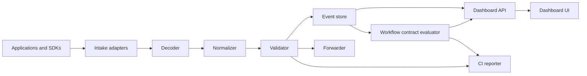

# Architecture

## Summary

Dogtap is a protocol-aware intake server with a validation pipeline and an operator dashboard.

## Components

### Intake adapters

Receive payloads from RUM, logs, APM, and OTLP sources. Each adapter should preserve enough request metadata to debug compatibility issues.

### Decoder

Handles content encoding and wire formats:

- gzip
- JSON
- text
- logplex-like payloads
- msgpack if required by APM traces
- protobuf for OTLP

### Normalizer

Maps source-specific payloads into common fields used by the dashboard and validators.

### Validator

Runs rules over raw metadata and normalized fields.

Initial rule groups:

- service tags
- workflow context
- PII and secrets
- query string leakage
- high-cardinality hints
- context leak detection

### Event store

Stores recent events and validation results. The default store is in-memory,
with optional JSON file snapshots and optional SQLite persistence for
restart-safe local, CI, isolated E2E, and dev-cluster inspection. All store
kinds remain bounded by TTL and max event count. Production mode must store
less, not more.

### Forwarder

Forwards payloads to Datadog when configured. Forwarding behavior is mode-specific.

### Dashboard

Provides inspection, filtering, correlation hints, and debug bundle export.

### Workflow contract evaluator

Evaluates YAML/JSON workflow contracts against retained event envelopes. It is
additive to validation: contracts answer whether a named path produced useful
RUM, replay, logs, traces, metrics, correlation, and privacy evidence, while
normal validation still checks individual payload quality.

## Deployment Shapes

### Local single container

All components run in one process and one container.

### CI headless

Dashboard is optional. Dogtap listens, validates, writes reports, and exits.

### Staging forwarder

Dogtap receives telemetry, validates it, stores redacted samples, and forwards to Datadog.

### Production tee

Dogtap should receive only sampled copies or act as a fail-open forwarding layer. Raw payload retention is disabled by default.

## Data Flow Rules

- Redaction must happen before persistence in production modes.
- Forwarding should not require raw payload persistence.
- Validation should not mutate the forwarded payload unless mode explicitly says `redact-only`.
- Debug bundles must disclose whether they include raw or redacted data.
